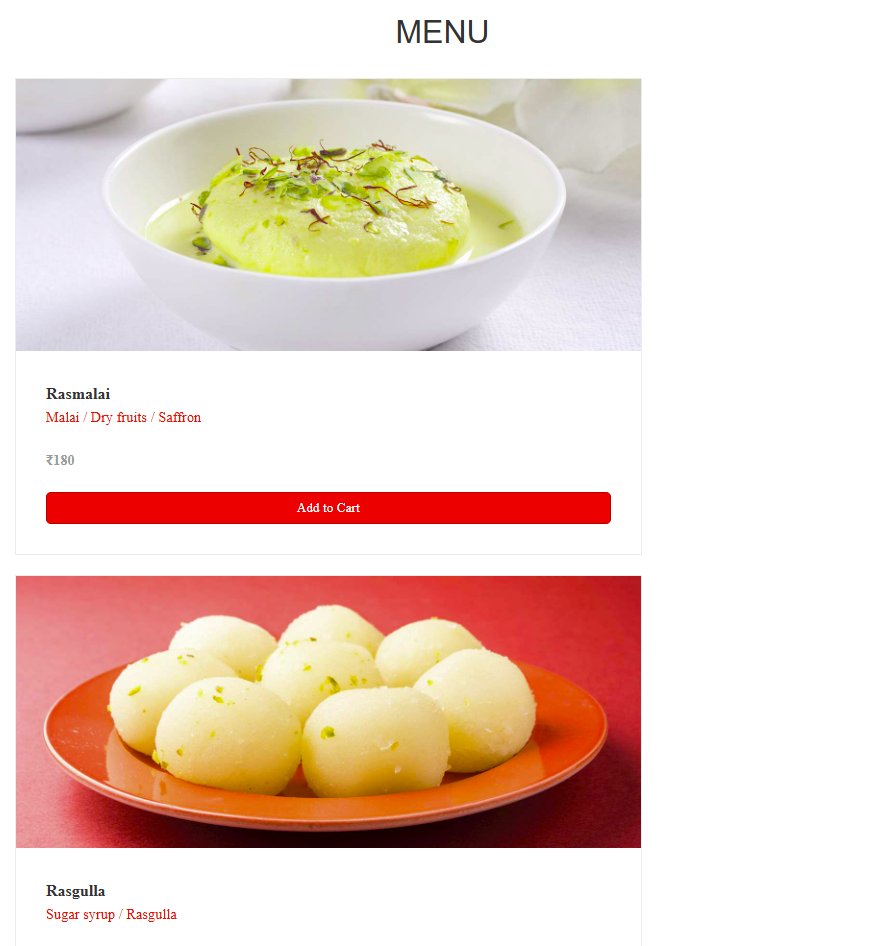
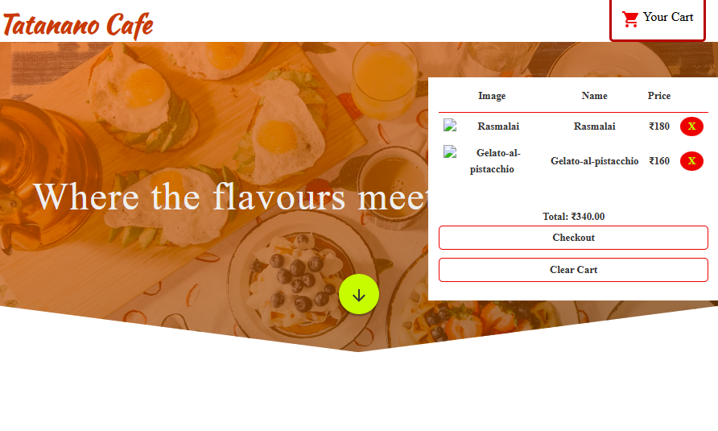

# 📱🍽️ Online QR Menu  

A simple, responsive, and **contactless digital menu** 🥢. Customers can scan a QR code and instantly view your restaurant’s menu on their phones — **no backend or hosting required!**  

---

## 🚀 Features  

✨ **Contactless Experience** – Customers scan the QR code to access the menu  
📖 **Digital Menu** – Clean and easy-to-navigate layout for food & drinks  
🎨 **Customizable** – Easily edit items, categories, and prices in code  
🌐 **Works Offline** – No internet or hosting needed, just open locally  
⚡ **Lightweight** – 100% frontend (HTML, CSS, JavaScript)  

---

## 🛠️ Tech Stack  

- 🌐 **Frontend**: HTML, CSS, JavaScript  
- 📲 **QR Code**: Any free QR generator (to link to your local file or a shared path)  

---

## 📷 Demo  

Here’s how the QR Menu looks in action 👇  

  
  
  
 

---

## 📦 Installation & Setup  

1. Download or clone this repository  
   ```bash
   git clone https://github.com/VaibhavBalgi/qr-menu.git
2. Open the folder  
   ```bash
   cd Online-QR-Menu
3. Double-click index.html to open it in your browser

## 🔗 Usage

1.✏️ Edit the index.html (or menu.json if you used one) to update food items, prices, and categories
2.📂 Copy the project folder to your laptop/tablet/phone
3.📱 Generate a QR Code that links to the index.html file path (or the device IP if shared over Wi-Fi)
4.🧾 Print & place the QR code on tables so customers can scan and view the menu

## 🤝 Contributing  

💡 Contributions are welcome!  
- Fork the repo 🍴  
- Create a branch 🌿  
- Commit your changes ✅  
- Submit a PR 🚀  
